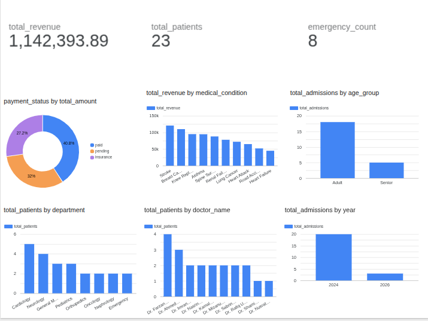

# MediTrack Analytics
> A real-time hospital operations monitoring and analytics system

## Overview

MediTrack Analytics is an end-to-end data analytics project that simulates a real hospital operations monitoring system. It tracks patient admissions, doctor workload, department occupancy, and billing transactions through a normalized relational database, complex SQL analytical views, a Python data simulator, and a live Looker Studio dashboard.

This project demonstrates a complete data pipeline — from database design to live visualization.

---

## Live Dashboard



**Dashboard Link:** [View Live Dashboard](https://datastudio.google.com/reporting/18203308-b025-46d4-9e03-1fc35f68fba1)

### Dashboard Highlights
- **Total Revenue:** 1,142,393.89 BDT across all admissions
- **Total Patients:** 23 admitted patients
- **Emergency Cases:** 8 emergency admissions
- Revenue breakdown by medical condition
- Patient distribution by department and doctor
- Admission trends by year
- Payment status analysis (Paid / Pending / Insurance)

---

## Tech Stack

| Tool | Purpose |
|---|---|
| MySQL | Relational database design and storage |
| MySQL Workbench | Schema creation and query writing |
| Python | Data simulation pipeline |
| Faker library | Realistic fake patient data generation |
| mysql-connector-python | Python to MySQL connection |
| python-dotenv | Secure credential management |
| Google Looker Studio | Live interactive dashboard |
| FreeSQLDatabase | Free cloud MySQL hosting |

---

## Cloud Database Setup

This project uses [FreeSQLDatabase](https://www.freesqldatabase.com) for free cloud MySQL hosting. This allows Looker Studio to connect to the database directly without any tunneling or local server exposure.

**Why FreeSQLDatabase?**
- Free MySQL hosting with no credit card required
- Provides a public host URL that Looker Studio can reach directly
- Suitable for small portfolio and demo projects

**To set up your own:**
1. Go to [freesqldatabase.com](https://www.freesqldatabase.com) and sign up
2. A MySQL database is created instantly — credentials are sent to your email
3. Use those credentials in your `.env` file (see Environment Setup below)
4. Connect MySQL Workbench using the provided host, port, username and password
5. Run the SQL files in order to recreate the schema

---

## Database Schema

### Tables

**departments** — stores hospital department information
- dept_id, dept_name, floor_no

**doctors** — stores doctor profiles linked to departments
- doctor_id, full_name, dept_id, specialization, phone_number

**patients** — stores patient demographic information
- patient_id, full_name, age, gender, blood_type, phone_number, created_at

**admissions** — stores each patient admission linked to doctor and department
- admission_id, patient_id, doctor_id, dept_id, medical_condition, admission_type, room_number, admitted_at, discharged_at

**transactions** — stores billing information for each admission
- transaction_id, admission_id, patient_id, billing_amount, payment_status, transaction_date

### Relationships
```
departments
    ├── doctors       (each doctor belongs to one department)
    └── admissions    (each admission tagged to a department)
            ├── patients      (each admission belongs to one patient)
            └── transactions  (each admission generates one bill)
```

---

## SQL Analytical Views

Seven complex SQL views power the dashboard:

| View | Business Question | SQL Features Used |
|---|---|---|
| `view_doctor_performance` | Which doctors handle the most patients and generate highest billing? | Multi-table JOIN, GROUP BY, SUM, CASE WHEN |
| `view_dept_occupancy` | Which department is busiest? | JOIN, COUNT, subquery |
| `view_monthly_trends` | How is patient volume changing over time? | DATE functions, GROUP BY |
| `view_billing_analysis` | Which conditions cost the most? | AVG, MAX, MIN, GROUP BY |
| `view_payment_summary` | How much is paid vs pending vs insurance? | GROUP BY, SUM |
| `view_full_admission_details` | Full picture of every admission | 5-table JOIN |
| `view_patient_risk_profile` | Which age groups appear most in emergencies? | CASE WHEN, age bucketing |

---

## Python Data Simulator

`simulator.py` continuously inserts realistic patient records into the database every 5 seconds, simulating a live hospital intake system.

**Libraries used:** `faker`, `mysql-connector-python`, `python-dotenv`, `random`, `datetime`

---

## Environment Setup

This project uses a `.env` file to keep database credentials secure. The `.env` file is never uploaded to GitHub.

**Step 1 — Copy the example env file**
```bash
cp .env.example .env
```

**Step 2 — Fill in your credentials in `.env`**
```
DB_HOST=your_host_here
DB_PORT=3306
DB_USER=your_username_here
DB_PASSWORD=your_password_here
DB_NAME=your_database_name_here
```

---

## How To Run Locally

**1. Clone the repository**
```bash
git clone https://github.com/Shanto00018/MediTrack-Analytics.git
cd MediTrack-Analytics
```

**2. Create a free cloud database**
- Go to [freesqldatabase.com](https://www.freesqldatabase.com) and sign up
- A MySQL database is created instantly — credentials are sent to your email
- This gives you a public host URL that Looker Studio can connect to directly

**3. Set up the schema**
- Open MySQL Workbench and create a new connection using your FreeSQLDatabase credentials
- Run the following SQL files in order against that connection:
  - `database_creation.sql` — creates all 5 tables
  - `sample_data.sql` — inserts doctors and departments as reference data
  - `view.sql` — creates all 7 analytical views

**4. Install Python dependencies**
```bash
python3 -m venv myenv
source myenv/bin/activate
pip install mysql-connector-python faker python-dotenv
```

**5. Configure environment variables**
```bash
cp .env.example .env
# open .env and fill in your FreeSQLDatabase credentials
```

**6. Run the simulator**
```bash
python simulator.py
```
This will insert a new patient record every 5 seconds into your cloud database.

**7. View the dashboard**
Open the Looker Studio dashboard link above. To connect your own database to Looker Studio, go to Looker Studio → Add Data → MySQL and enter your FreeSQLDatabase credentials.

---

## Project Structure

```
MediTrack-Analytics/
├── database_creation.sql   # Schema: CREATE TABLE statements
├── sample_data.sql         # Initial INSERT statements for doctors and departments
├── view.sql                # All 7 analytical SQL views
├── simulator.py            # Python live data simulator
├── .env.example            # Environment variable template
├── .gitignore              # Excludes .env and myenv from GitHub
├── final.png               # Dashboard screenshot
└── README.md               # Project documentation
```

---

## Key Learnings

- Designed a normalized 5-table relational schema from scratch following real hospital data models
- Wrote complex SQL queries using multi-table JOINs, CASE WHEN bucketing, and date functions
- Built a Python pipeline that simulates continuous live data insertion
- Secured credentials using environment variables and .gitignore
- Connected a cloud MySQL database to a live Looker Studio dashboard

---

## Author

**Shanto** — Final Year CSE Student, BUET  
GitHub: [Shanto00018](https://github.com/Shanto00018)
